<div align="center">


# SmartSort

**Messy folders, organized by what's _inside_ your files — entirely on your own computer.**

[](#-macos)
[](#-windows)
[](engine)
[](https://huggingface.co/google/embeddinggemma-2)
[](#-safety-and-privacy)
[](LICENSE)

<br>

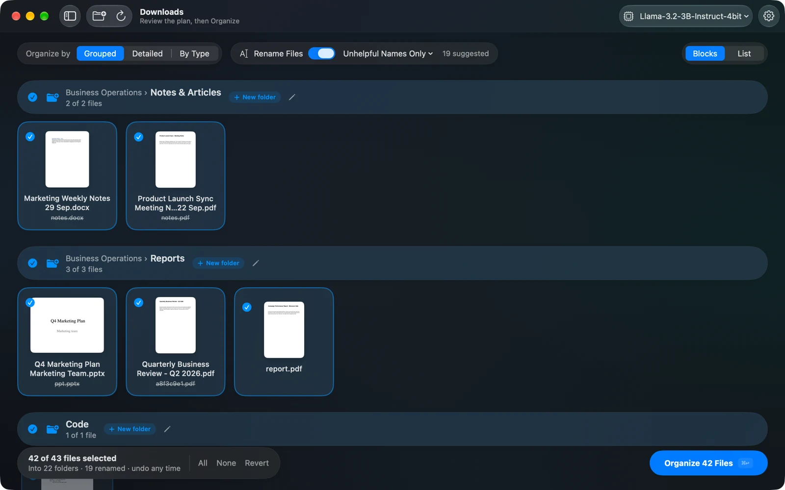

<sub>SmartSort on macOS: 43 loose files in Downloads become 22 folders and 19 clearer names. Click any file to leave it where it is.</sub>

</div>

<br>

`document(3).pdf`, `scan_0012.pdf`, `IMG_3301.pdf`, `final.pdf`… Every computer has a folder like this.
SmartSort **reads each file** — documents, scans, screenshots and photos — groups the ones that
belong together, names the folders the way a person would (*Food Deliveries*, *Travel Documents*,
*Bills & Statements*), and suggests clear file names. You review the plan, untick anything that
should stay put, and click **Organize**. One click puts everything back.

No account. No cloud. No upload. The AI runs on your machine.

---

## ✨ Highlights

|   |   |
|---|---|
| 🧠 **Understands content, not names** | Groups files by what they're about, using Google's **EmbeddingGemma 2** — text, PDFs, Word, PowerPoint, code, scans and images. |
| 🏷️ **Folders named like a human would** | A small local language model (Llama 3.2 3B by default — or any model you have) writes folder names, so there's no fixed category list. |
| ✏️ **Clear new file names** | `IMG_3301.pdf` → `Dosa Corner 2026-09-26.pdf`. Every suggested name is **fact-checked** against the document, so dates and companies are never invented. Edit any name yourself. |
| ☑️ **You decide** | Review as **Blocks** (with real previews) or a **List**. Click a file to leave it in place; tick or untick a whole folder; rename folders; move files between them. |
| 🔄 **Re-run any time** | Analyze an organized folder again and SmartSort only looks at the **new** files, filing them into your existing folders (and making new ones only when nothing fits). |
| 🪄 **Finds models by itself** | Detects EmbeddingGemma 2 and chat models from Hugging Face, LM Studio, Ollama and your Models folder. No paths to type. |
| ↩️ **Safe by design** | Preview first, never deletes or overwrites, duplicates set aside, full **undo** — even after an interrupted run. |
| 💻 **Mac & Windows** | A native SwiftUI app for macOS and a Qt desktop app for Windows (and Linux), on the same Python engine. |

---

## 📸 Screenshots

<table>
  <tr>
    <td width="50%">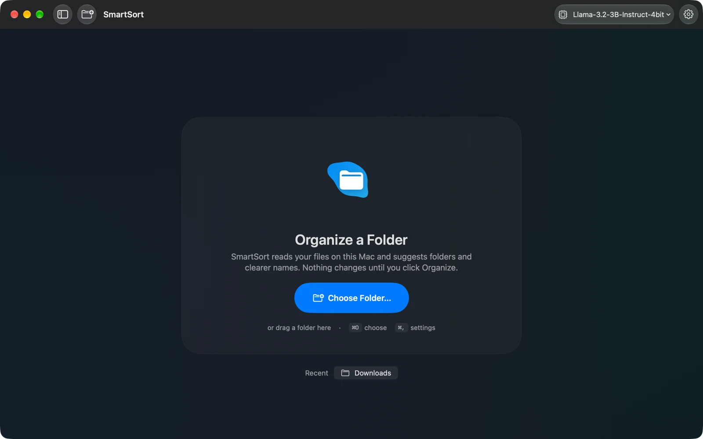<br><sub><b>Start</b> — choose or drop a folder.</sub></td>
    <td width="50%">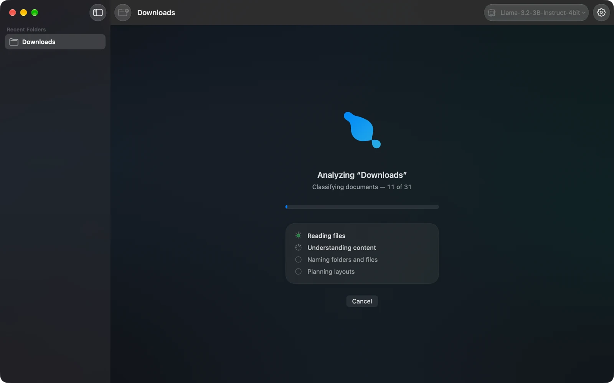<br><sub><b>Analyzing</b> — steps tick off as the models work.</sub></td>
  </tr>
  <tr>
    <td>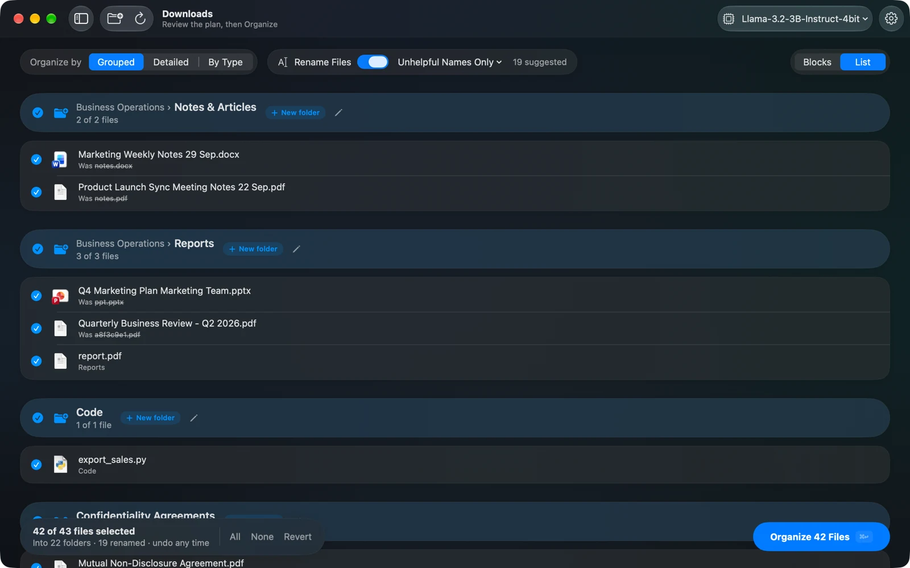<br><sub><b>List view</b> — every file, its new name and its old one.</sub></td>
    <td>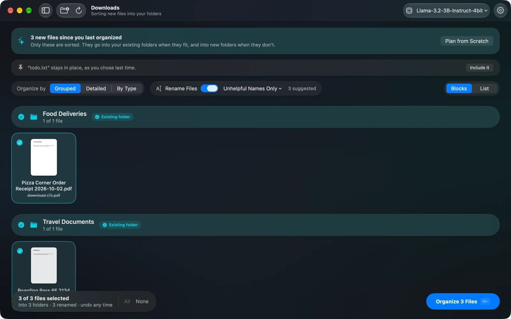<br><sub><b>Analyze again</b> — only new files, sorted into your existing folders.</sub></td>
  </tr>
  <tr>
    <td>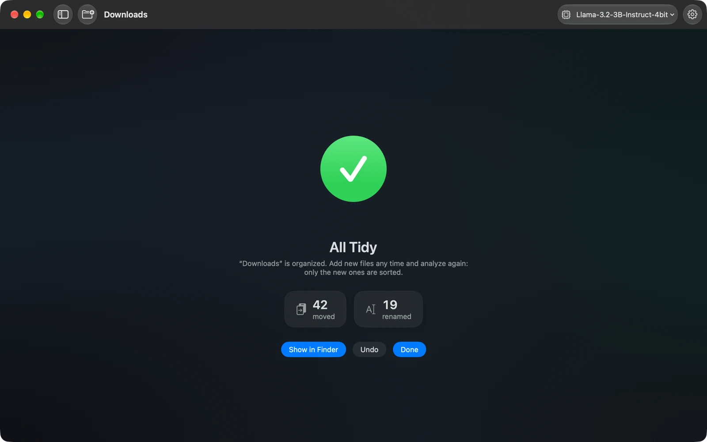<br><sub><b>Done</b> — moved and renamed, with Undo one click away.</sub></td>
    <td align="center">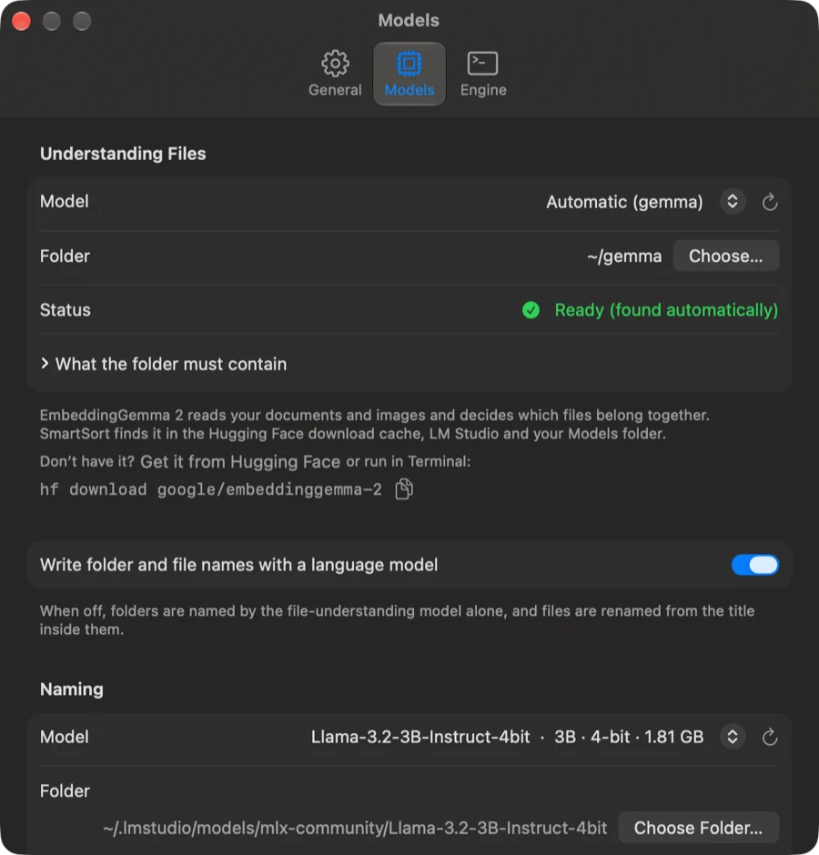<br><sub><b>Settings</b> — models found automatically.</sub></td>
  </tr>
</table>

<details>
<summary><b>🪟 The Windows app</b> (click to expand)</summary>
<br>

<table>
  <tr>
    <td width="50%">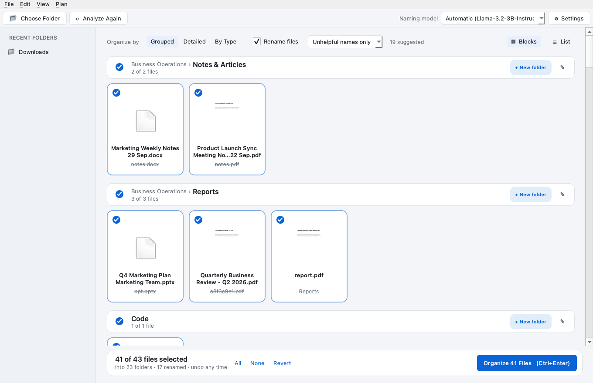<br><sub>Blocks view with page previews.</sub></td>
    <td width="50%"><br><sub>List view.</sub></td>
  </tr>
  <tr>
    <td>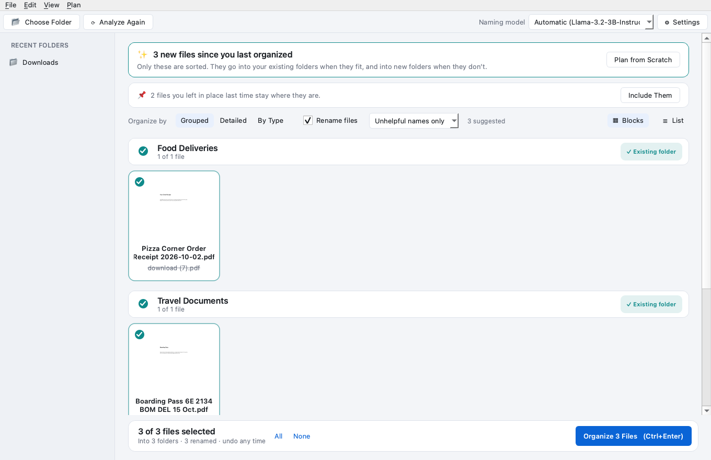<br><sub>Analyze again: only the new files.</sub></td>
    <td>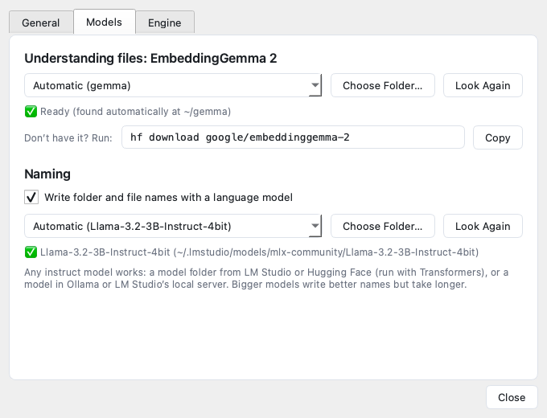<br><sub>Models are found automatically.</sub></td>
  </tr>
</table>

<sub>These were rendered from the Windows app's own code (Qt, Fusion style); on Windows it uses the system fonts and file icons.</sub>
</details>

---

## 🧠 How it works

```mermaid
flowchart LR
    A["📂 Loose files<br/><sub>PDF · Word · PowerPoint · text<br/>code · scans · photos</sub>"] --> B["📖 Read<br/><sub>text, title, page 1 of scans,<br/>image pixels · SHA-256</sub>"]
    B --> C["🧠 EmbeddingGemma 2<br/><sub>one 768-d vector per file<br/>for <i>topic</i> and for <i>type</i></sub>"]
    C --> D["🧩 Group<br/><sub>clustering on centred vectors<br/>+ duplicate & copy detection</sub>"]
    D --> E["🏷️ Name<br/><sub>local chat model writes folder<br/>and file names · fact-checked</sub>"]
    E --> F["👀 You review<br/><sub>blocks or list · untick ·<br/>rename · move</sub>"]
    F --> G["✅ Organize<br/><sub>journaled moves ·<br/>one-click undo</sub>"]
```

1. **Read.** Each loose file is opened just enough to understand it: the first pages of a PDF,
   Word or PowerPoint file, the text of notes and code, and the *pixels* of images and scanned PDFs.
   Files above a size limit (50 MB by default) are left unopened and sorted by type.
2. **Understand.** EmbeddingGemma 2 turns every file into a vector — a point in a 768-dimensional
   "meaning space" where an Uber receipt lands next to an Ola invoice even though they share no words.
   It does this twice, with two task prompts: once for **what the file is about** (clustering) and once
   for **what kind of document it is** (classification: invoice, statement, ticket, contract…).
3. **Group.** Files are clustered by meaning. The vectors are centred on the folder's own "average
   document" first, which spreads them out so groups separate cleanly. Exact copies, re-saved PDFs and
   resized photos are spotted and set aside in *Duplicates*.
4. **Name.** A small chat model reads short excerpts from each group and names the folder; it also
   writes names for files with unhelpful ones. Each name is checked against the file: a date, company
   or person that isn't in the document gets the name rejected. Without a chat model, EmbeddingGemma
   picks folder names from a large bank of candidates instead.
5. **Review and organize.** Nothing moves until you click **Organize**. Every move is written to a
   journal *before* it happens, so **Undo** always works.

**Analyzing again** a folder that's already organized only reads the new loose files. Each one is
compared with the files already in SmartSort's folders: a clear match goes straight in; a possible
match is double-checked by the chat model (*"does this belong with these files?"*); anything else gets
a new folder. Files you chose to leave in place are remembered and skipped.

---

## 💎 Why EmbeddingGemma 2 makes this possible

Sorting by content used to mean sending your files to a cloud API or hand-writing rules. [EmbeddingGemma 2](https://huggingface.co/google/embeddinggemma-2)
(Google DeepMind, Apache 2.0) changes that:

- 🖼️ **Text and images in one space.** It embeds documents *and pictures* into the same 768-dimensional
  space. That's why a **scanned receipt with no text layer** can still land in *Food Deliveries*, and why
  screenshots, photos and charts are told apart — no OCR step needed.
- 🪶 **Small enough for a laptop.** 740M parameters in total, and SmartSort loads only the text and vision
  parts (about 440M), skipping the audio encoder. It runs on Apple silicon (Metal), NVIDIA GPUs (CUDA)
  or a plain CPU.
- 🎯 **Task prompts.** The same model gives different vectors for different jobs. SmartSort asks for
  *clustering* vectors to find topics and *classification* vectors to find document types — two views of
  every file from one model.
- 🌍 **100+ languages, and code.** Google reports strong results across 100+ languages and on code, so
  documents aren't limited to English and scripts are grouped by what they do. (Folder names are written in English.)
- 📏 **Long context (8K tokens).** Enough to read a meaningful chunk of each document, not just its first line.
- 🔒 **On-device by design.** Files never leave your computer, and vectors are cached by content hash,
  so re-running on the same files takes seconds.

The result: folders that come **from your files**, not from a fixed list of categories.

---

## 🚀 Getting started

> **You'll need about 6 GB of disk** for the engine and models (EmbeddingGemma 2 ≈ 1.5 GB, Llama 3.2 3B ≈ 1.8 GB, PyTorch).
> Everything is downloaded once; after that SmartSort works offline.

### 🍎 macOS

**Requirements:** macOS 14 Sonoma or later · Apple silicon recommended (Intel works too) · [Xcode](https://apps.apple.com/app/xcode/id497799835) 16 or later to build the app · [Git](https://git-scm.com)

**1. Get the code**

```bash
git clone https://github.com/anshkapuriya01/SmartSort.git
cd SmartSort
```

**2. Run the setup script**

```bash
./scripts/setup-macos.sh
```

It does everything, and skips whatever is already done:

| Step | What happens |
|---|---|
| 1 | Installs [uv](https://docs.astral.sh/uv/) (a fast Python installer) if you don't have it |
| 2 | Creates `engine/.venv` and installs the SmartSort engine |
| 3 | Downloads **EmbeddingGemma 2** and **Llama 3.2 3B Instruct (MLX)** — unless they're already on your Mac (e.g. from LM Studio) |
| 4 | Builds **SmartSort.app** and copies it to `/Applications` |

**3. Open SmartSort** from Applications and drop a folder on it. That's it — the app finds the engine and both models on its own.

<details>
<summary><b>Prefer to do it by hand?</b></summary>

```bash
# Engine
uv venv engine/.venv --python 3.12
VIRTUAL_ENV=engine/.venv uv pip install -e engine

# Models (into the Hugging Face cache, where SmartSort finds them)
engine/.venv/bin/hf download google/embeddinggemma-2
engine/.venv/bin/hf download mlx-community/Llama-3.2-3B-Instruct-4bit   # optional

# Check what SmartSort found
engine/.venv/bin/smartsort models

# App: open macos/SmartSort.xcodeproj in Xcode and press ⌘R
```

Options: `./scripts/setup-macos.sh --no-app` (engine and models only) · `--no-naming-model`.
</details>

### 🪟 Windows

> The Windows app is new. If something doesn't work on your PC, please [open an issue](https://github.com/anshkapuriya01/SmartSort/issues) — it helps a lot.

**Requirements:** Windows 10 or 11 (64-bit) · Python 3.11+ · Git. Optional: an NVIDIA GPU, [Ollama](https://ollama.com/download).

**1. Install Python and Git** (skip what you have) — in PowerShell:

```powershell
winget install Python.Python.3.12
winget install Git.Git
```

Close and reopen PowerShell afterwards so both are on your PATH.

**2. Get the code**

```powershell
git clone https://github.com/anshkapuriya01/SmartSort.git
cd SmartSort
```

**3. Run the setup script**

```powershell
powershell -ExecutionPolicy Bypass -File windows\setup.ps1
```

Have an NVIDIA graphics card? Add `-Cuda` for much faster analysis:

```powershell
powershell -ExecutionPolicy Bypass -File windows\setup.ps1 -Cuda
```

The script creates a Python environment in `engine\.venv`, installs PyTorch, the engine and the app,
downloads **EmbeddingGemma 2**, and adds **SmartSort** to the Start Menu and Desktop.

**4. Add a naming model (recommended).** Install [Ollama](https://ollama.com/download), then:

```powershell
ollama pull llama3.2:3b
```

SmartSort finds it automatically whenever Ollama is running. (Already use LM Studio? Start its local server and SmartSort will find its models too.)

**5. Open SmartSort** from the Start Menu and drop a folder on it.

<details>
<summary><b>Prefer to do it by hand?</b></summary>

```powershell
py -3.12 -m venv engine\.venv
engine\.venv\Scripts\pip install torch torchvision          # or: --index-url https://download.pytorch.org/whl/cu128
engine\.venv\Scripts\pip install -e engine -e windows
engine\.venv\Scripts\hf download google/embeddinggemma-2
engine\.venv\Scripts\python -m smartsort.cli models        # what SmartSort found
engine\.venv\Scripts\pythonw -m smartsort_app              # start the app
```
</details>

### 🐧 Linux

The Windows app is a cross-platform Qt app, so it runs on Linux too:

```bash
git clone https://github.com/anshkapuriya01/SmartSort.git && cd SmartSort
uv venv engine/.venv --python 3.12
VIRTUAL_ENV=engine/.venv uv pip install -e engine -e windows
engine/.venv/bin/hf download google/embeddinggemma-2
engine/.venv/bin/python -m smartsort_app
```

---

## 🤖 Models: found automatically

Run `smartsort models` (or open **Settings › Models**) to see what SmartSort found:

```text
$ smartsort models
Understanding files (EmbeddingGemma 2)
  ✓ in use embeddinggemma-2  ~/.cache/huggingface/hub/models--google--embeddinggemma-2/snapshots/…

Naming (chat models)  MLX: yes
  ✓ in use Llama-3.2-3B-Instruct-4bit  3B · 1.8 GB · LM Studio · mlx
           llama3.2:3b                 3.2B · 2.0 GB · Ollama · ollama
           Qwen3.5-9B-MLX-4bit         9B · 6.0 GB · LM Studio · mlx
```

**Where it looks**

| Source | Location |
|---|---|
| 🤗 Hugging Face cache | `~/.cache/huggingface/hub` (or `HF_HOME` / `HF_HUB_CACHE`) — where `hf download` puts models |
| 🧪 LM Studio | `~/.lmstudio/models`, or the folder set in LM Studio's settings; plus its local server (GGUF models too) |
| 🦙 Ollama | the running Ollama app (`OLLAMA_HOST`), or its models folder when it's closed |
| 📁 Your folders | `~/Models`, `~/models`, `SmartSort/models`, and anything in `SMARTSORT_MODELS_DIR` |

**How naming models run**

| Your computer | Model folders (safetensors) | Ollama / LM Studio server |
|---|---|---|
| Mac with Apple silicon | ✅ MLX — fast, on the GPU | ✅ |
| Windows / Linux / Intel Mac | ✅ Transformers (CUDA if available) | ✅ recommended |

"Automatic" picks a known-good small model (Llama 3.2 3B, Qwen 3/2.5, Gemma 3, Phi 3.5…) if you have one,
otherwise the smallest model that runs. Pick any other in **Settings**, from the toolbar's model menu,
or with `--namer` on the command line. Bigger models write slightly better names but take longer;
3–4B models are the sweet spot.

---

## ⌨️ Command line

The engine is a full command-line tool too:

```bash
smartsort ~/Downloads --dry-run          # show the plan, change nothing
smartsort ~/Downloads                    # choose a layout, review, apply
smartsort ~/Desktop --scheme type -y     # By Type layout, no questions
smartsort ~/Documents --topics "Taxes, Travel, Work"   # your own folder names
smartsort ~/Downloads --namer ollama:llama3.2:3b       # pick the naming model
smartsort undo ~/Downloads               # put everything back
smartsort models                         # what models were found
```

<details>
<summary><b>App shortcuts</b></summary>

| macOS | Windows | Action |
|---|---|---|
| ⌘O | Ctrl+O | Choose a folder (or drag one in) |
| ⌘R | Ctrl+R | Analyze again (new files only) |
| ⌘1 / ⌘2 | Ctrl+1 / Ctrl+2 | Blocks / List view |
| ⇧⌘A / ⇧⌘D | Ctrl+Shift+A / D | Select all files / leave all in place |
| ⇧⌘N | Ctrl+Shift+N | Suggested names on/off |
| Space | double-click | Preview a file |
| ⌘↩ | Ctrl+Enter | Organize |
| Edit › Undo Organize | Ctrl+Z | Undo organize |
| ⌘, | Ctrl+, | Settings |
</details>

---

## 🔒 Safety and privacy

- **Nothing leaves your computer.** Models run locally; Ollama and LM Studio are reached on `localhost` only.
- **Preview first.** Nothing moves until you click Organize.
- **Never deletes or overwrites.** Duplicates go to `Duplicates/`; name clashes get ` (2)`.
- **Undo, always.** Every move is journaled in `.smartsort/` *before* it happens — even an interrupted run can be undone.
- **Only loose files.** Files at the top of the chosen folder are organized; your existing subfolders are never touched, and new files are only ever filed into folders SmartSort made.
- **When unsure, it says so.** Unreadable, encrypted or ambiguous files go to `Needs Review/` instead of getting a made-up label.

---

## 🛠️ Tech stack

| Layer | Built with |
|---|---|
| AI — understanding | **EmbeddingGemma 2** via Sentence Transformers 6 + PyTorch (Metal / CUDA / CPU) |
| AI — naming | **MLX** on Apple silicon · **Transformers** · **Ollama** · **LM Studio** — any local instruct model |
| Engine | Python 3.11+, scikit-learn (agglomerative clustering), PyMuPDF, python-docx, python-pptx, Pillow + HEIF |
| macOS app | **SwiftUI** + Observation, `MeshGradient`, SF Symbols animations, Quick Look thumbnails · built with XcodeGen |
| Windows / Linux app | **Qt 6 (PySide6)** with a Fluent-inspired light/dark theme |
| Glue | JSON-lines protocol (`smartsort api …`) shared by both apps · `uv` for setup |

<details>
<summary><b>📁 Project structure</b></summary>

```text
SmartSort/
├── engine/                 Python engine + CLI (pip package "smartsort")
│   └── smartsort/
│       ├── extract.py      read files: text, titles, scans, images
│       ├── embed.py        EmbeddingGemma 2 vectors (cached by content hash)
│       ├── analyze.py      types, groups, duplicates, matching existing folders
│       ├── namer.py        folder and file names from a chat model, fact-checked
│       ├── models.py       finds models: Hugging Face, LM Studio, Ollama, folders
│       ├── llm.py          runs chat models: MLX, Transformers, Ollama, LM Studio
│       ├── plan.py         layouts (Grouped, Detailed, By Type)
│       ├── apply.py        journaled moves and undo
│       ├── update.py       "analyze again": only new files
│       ├── api.py          JSON-lines interface for the apps
│       └── cli.py          the smartsort command
├── macos/                  SwiftUI app (project.yml → xcodegen)
├── windows/                Qt app for Windows and Linux + setup.ps1
├── scripts/setup-macos.sh  one-step macOS setup
└── docs/screenshots/
```
</details>

---

## 🙋 FAQ

<details>
<summary><b>Does it need the internet?</b></summary>
Only once, to download the models. After that it works fully offline.
</details>

<details>
<summary><b>How fast is it?</b></summary>
On an Apple silicon Mac, a folder of ~40 mixed files takes well under a minute the first time
(most of it is loading the models) and a few seconds afterwards, because every file's vectors and
names are cached by content. Without a GPU, expect it to be a few times slower.
</details>

<details>
<summary><b>Can I use a different or bigger model?</b></summary>
Yes. Any instruct model in LM Studio, Ollama or a Hugging Face folder works — pick it in Settings or
from the toolbar. EmbeddingGemma 2 itself is required for understanding files.
</details>

<details>
<summary><b>"EmbeddingGemma 2 wasn't found"</b></summary>
Run <code>hf download google/embeddinggemma-2</code> (it's in <code>engine/.venv/bin</code> or
<code>engine\.venv\Scripts</code>), then click <b>Look Again</b> in Settings › Models. If you keep the model
somewhere unusual, choose its folder there.
</details>

<details>
<summary><b>The app says the engine wasn't found</b></summary>
Run the setup script once. If you installed the engine elsewhere (for example with
<code>uv tool install ./engine</code>), point <b>Settings › Engine</b> at the <code>smartsort</code> command.
</details>

<details>
<summary><b>Where are my settings, caches and undo history?</b></summary>
Undo history lives in a hidden <code>.smartsort</code> folder inside each organized folder. Caches are in
<code>~/Library/Caches/smartsort</code> (macOS), <code>%LOCALAPPDATA%\SmartSort\Cache</code> (Windows) or
<code>~/.cache/smartsort</code> (Linux) and can be deleted any time.
</details>

---

## 🤝 Contributing

Issues and pull requests are welcome! A good first step is the demo folder generator:

```bash
engine/.venv/bin/python engine/demo/make_sample.py ~/smartsort-demo   # a realistic messy folder
engine/.venv/bin/smartsort ~/smartsort-demo --dry-run
```

If you change Swift files' names or add new ones, regenerate the Xcode project with `xcodegen generate` in `macos/`.

## 📄 License

SmartSort is released under the [MIT License](LICENSE).

The models are separate downloads under their own licenses:
[EmbeddingGemma 2](https://huggingface.co/google/embeddinggemma-2) (Apache 2.0, Google DeepMind) ·
[Llama 3.2](https://www.llama.com/llama3_2/license/) (Llama 3.2 Community License, Meta) — or whichever chat model you choose.

<div align="center">
<br>
<sub>Made with ☕ and a very messy Downloads folder.</sub>
</div>
